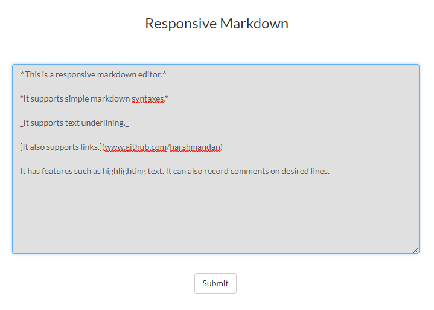
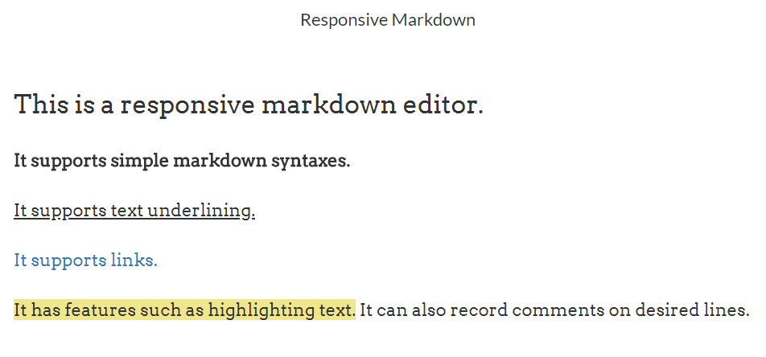
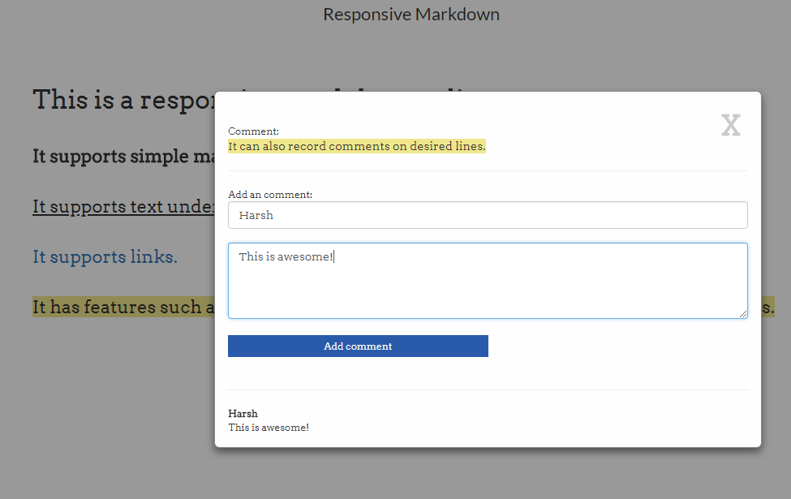

# Simple-Markdown-Webapp

> A markdown editor has following features:
> * Underline
> * Large 
> * Bold

> It also supports after markdown highlighting and commenting.


## Screenshots:


> Markdown syntax rules.



> Markdown result and highligted text.



> Adding comment to a line.

## Requirements & Set-up

NodeJS
ExpressJS

After putting all files in a folder go to console:
```sh
npm install
node server.js
```
